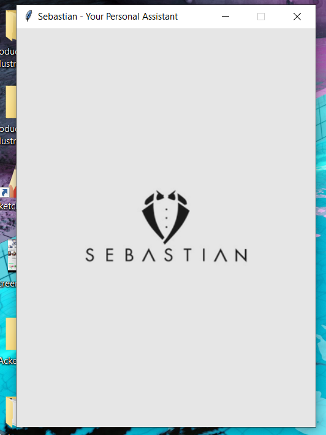
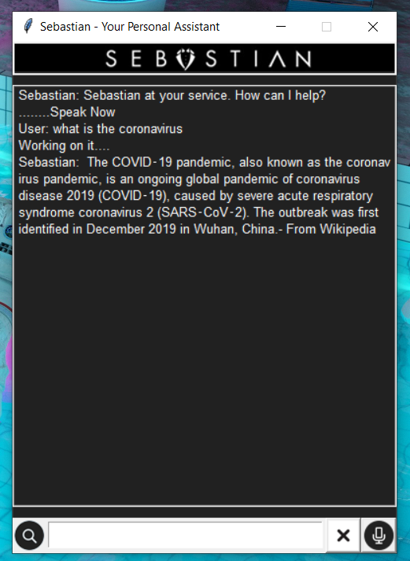

<p align="center" ><a href="https://github.com/Uzair-Fasih/Sebastian" target="_blank" rel="noopener noreferrer"></a></p>

<p align="center" >
Your personal Open source voice assitant. 
</p>
<br/>
<p align="center" >
</p>

## What is Sebastinan?

Sebastian is a virtual voice assistant built with Python. This project was an early experiment from college. The application uses STT and TTS packages for handling the user interaction and uses API from various clients like WolframAlpha, Wikipedia and other websites using BeautifulSoup for scraping and many other Resful API.

<p align="center">

</p>
<p align="center">

</p>

## How to install?

1. Clone this repo to your computer

2. Install the dependencies
```bash
pip install -r requirements.txt
```
3. Install PyAudio using the following commands

```bash
pip install pipwin
pipwin install pyaudio
```

## How to use?
1. Simply run SebastianGUI.py

```
python SebastianGUI.py
```

### Using Voice

2. Click on the mic icon to start your session
3. Wait for the beep to start talking
4. To end the session, say "Stop Listening"


### Using Text

1. Simply type into the input box